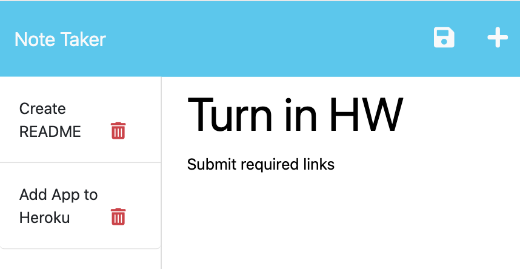

# Note Taker

## Description

This is a note taking app that allows users to write and save notes to help keep track of tasks that need completing. Notes can be saved, viewed, and deleted.

Key takeaways from buiding this project:
- file organization is crucial
- routes follow a logical path

## Usage

Click the "Get Started" button on the landing page.

On the left side will be any saved notes. On the right side is a place holder for "Note Title" and "Note Text". When the user clicks into this area to write a note, a save icon will appear. Once they have input their note, they can click the save icon to update the tracked note list. 

The user may click on a saved note to view the full text. They can click the delete icon to remove the note from the list.

[Video of App in Use](https://drive.google.com/file/d/1JQqF5eLd5Pzy4ysUrcULA2gYo2wkhYm4/view)

[Deployed Note Taker](https://knote-taker.herokuapp.com/)

## License

MIT License

Copyright (c) 2023 Kate Rogers

Permission is hereby granted, free of charge, to any person obtaining a copy
of this software and associated documentation files (the "Software"), to deal
in the Software without restriction, including without limitation the rights
to use, copy, modify, merge, publish, distribute, sublicense, and/or sell
copies of the Software, and to permit persons to whom the Software is
furnished to do so, subject to the following conditions:

The above copyright notice and this permission notice shall be included in all
copies or substantial portions of the Software.

THE SOFTWARE IS PROVIDED "AS IS", WITHOUT WARRANTY OF ANY KIND, EXPRESS OR
IMPLIED, INCLUDING BUT NOT LIMITED TO THE WARRANTIES OF MERCHANTABILITY,
FITNESS FOR A PARTICULAR PURPOSE AND NONINFRINGEMENT. IN NO EVENT SHALL THE
AUTHORS OR COPYRIGHT HOLDERS BE LIABLE FOR ANY CLAIM, DAMAGES OR OTHER
LIABILITY, WHETHER IN AN ACTION OF CONTRACT, TORT OR OTHERWISE, ARISING FROM,
OUT OF OR IN CONNECTION WITH THE SOFTWARE OR THE USE OR OTHER DEALINGS IN THE
SOFTWARE.
